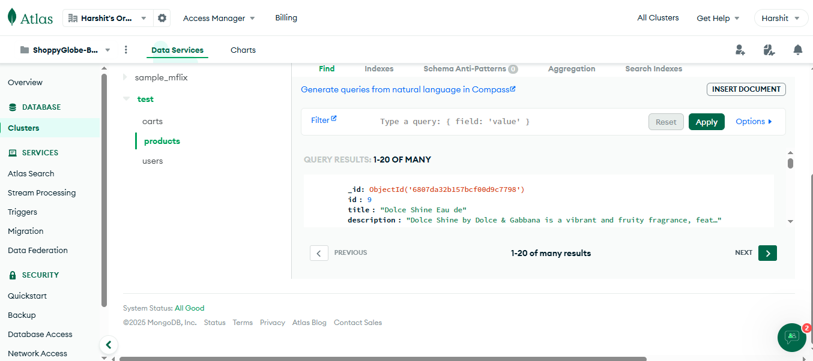

# 🛍️ ShoppyGlobe E-commerce App

A full-stack e-commerce app with product listings, cart functionality, and user authentication.

## Table of Contents
- [Tech Stack](#-tech-stack)
- [Features](#-features)
- [MongoDB Integration](#️-mongodb-integration)
- [ThunderClient + MongoDB Atlas Testing](#-thunderclient--mongodb-atlas-testing)
- [Folder Structure](#-folder-structure)
- [Environment Variables](#-environment-variables)
- [Installation](#-installation)
- [Deployment](#-deployment)
- [Author](#-author)

## 🚀 Tech Stack
- **Frontend:** React, Tailwind CSS, Axios, React Router
- **Backend:** Node.js, Express, MongoDB (Atlas)
- **Authentication:** JWT

## 🧾 Features
- User login & signup
- Browse products
- Add to cart (protected route)
- Dynamic cart count & user info
- Protected checkout route

## 🗄️ MongoDB Integration
**Database:** `test`

**Collections:**
- `products`: Stores product data (name, price, description, stock)
- `carts`: Stores cart items (product IDs and quantities)
- `users`: Stores user authentication data

**CRUD operations implemented for:**
- **Products:** Create, Read, Update, Delete
- **Cart Items:** Add to Cart, Update Quantity, Remove Items, Clear Cart

## 🧪 ThunderClient + MongoDB Atlas Testing

All API endpoints were tested using ThunderClient, and results were verified in MongoDB Atlas. Below are the screenshots:

### Authentication Routes
| **API Route**               | **Description**              | **ThunderClient Screenshot**             | **MongoDB Atlas Screenshot**             |
|------------------------------|-------------------------------|-------------------------------------------|-------------------------------------------|
| `POST /api/auth/register`    | Register a new user           |  |  |
| `POST /api/auth/login`       | User login and get token      |         |  |

### Product Routes
| **API Route**               | **Description**              | **ThunderClient Screenshot**             | **MongoDB Atlas Screenshot**             |
|------------------------------|-------------------------------|-------------------------------------------|-------------------------------------------|
| `POST /api/products/`        | Create a new product          |  |  |
| `GET /api/products/`         | Fetch all products            |  |  |
| `GET /api/products/:id`      | Fetch a single product        |  |  |

### Cart Routes
| **API Route**               | **Description**              | **ThunderClient Screenshot**             | **MongoDB Atlas Screenshot**             |
|------------------------------|-------------------------------|-------------------------------------------|-------------------------------------------|
| `POST /api/cart/`            | Add product to cart (Protected) |  |  |
| `GET /api/cart/`             | Get user's cart (Protected)   |         |  |
| `PUT /api/cart/:productId`   | Update quantity in cart (Protected) |  |  |
| `DELETE /api/cart/:productId`| Remove an item from cart (Protected) |  |  |
| `DELETE /api/cart/clear`     | Clear the cart (Protected)    |      |  |

### User Routes
| **API Route**               | **Description**              | **ThunderClient Screenshot**             | **MongoDB Atlas Screenshot**             |
|------------------------------|-------------------------------|-------------------------------------------|-------------------------------------------|
| `GET /api/user/profile`      | Get logged-in user's profile  |  |  |
| `PUT /api/user/profile`      | Update user profile           |  |  |

### Miscellaneous
| **Test**                    | **Description**              | **ThunderClient Screenshot**             |
|------------------------------|-------------------------------|-------------------------------------------|
| **Invalid Route**            | Testing Not Found route (`404`) |  |
| **Global Error Handling**    | Testing server-side error handling |  |


## 🔧 Folder Structure

```plaintext
shoppyglobe/
├── backend/
│   ├── config/
│   │   └── db.js
│   ├── controllers/
│   │   ├── authController.js
│   │   ├── cartController.js
│   │   ├── productController.js
│   │   └── userController.js
│   ├── middleware/
│   │   ├── authMiddleware.js
│   │   ├── errorMiddleware.js
│   │   └── notFound.js
│   ├── models/
│   │   ├── Cart.js
│   │   ├── Product.js
│   │   ├── User.js
│   ├── routes/
│   │   ├── authRoutes.js
│   │   ├── cartRoutes.js
│   │   ├── productRoutes.js
│   │   └── userRoutes.js
│   ├── .env
│   ├── server.js
│   ├── package.json
│   └── package-lock.json
│
├── frontend/
│   ├── public/
│   │   ├── favicon.jpeg
│   │   └── vite.svg
│   ├── src/
│   │   ├── api/
│   │   │   └── cartAPI.js
│   │   ├── assets/
│   │   ├── components/
│   │   │   ├── Auth/
│   │   │   │   ├── Login.jsx
│   │   │   │   └── Signup.jsx
│   │   │   ├── Cart/
│   │   │   │   ├── Cart.jsx
│   │   │   │   ├── CartItem.jsx
│   │   │   │   └── Checkout.jsx
│   │   │   ├── Product/
│   │   │   │   ├── ProductDetail.jsx
│   │   │   │   ├── ProductItem.jsx
│   │   │   │   └── ProductList.jsx
│   │   │   └── Shared/
│   │   │       ├── Footer.jsx
│   │   │       ├── Header.jsx
│   │   │       └── LoadingSpinner.jsx
│   │   ├── context/
│   │   │   ├── AuthContext.jsx
│   │   │   └── CartContext.jsx
│   │   ├── hooks/
│   │   │   └── useFetch.js
│   │   ├── utils/
│   │   │   ├── axiosAuth.js
│   │   │   └── axiosInstance.js
│   │   ├── App.jsx
│   │   ├── App.css
│   │   ├── main.jsx
│   │   ├── index.css
│   │   └── index.html
│   ├── vite.config.js
│   ├── package.json
│   └── package-lock.json
│
└── README.md

```

## 🔧 Environment Variables

### 🔒 Backend `.env`
Create a `.env` file inside the `backend/` folder:

```env
NODE_ENV=development
PORT=5000
MONGO_URI=<your-mongodb-connection-string>
JWT_SECRET=<your-secret-key>
```
📌 **Note:** Replace `<your-mongodb-connection-string>` and `<your-secret-key>` with your actual values.

### 🌐 Frontend `.env`
Create a `.env` file inside the `frontend/` folder:

```env
VITE_API_BASE_URL=https://shoppyglobe-fullstack-yy0k.onrender.com/api
```
Make sure this value matches your deployed backend API URL or use `http://localhost:5000/api` for local development.

## 📦 Installation

1. Clone the repository:
   ```bash
   git clone https://github.com/sharmaHarshit2000/shoppyglobe-fullStack.git
   cd shoppyglobe-fullStack
   ```

2. Install dependencies for the backend:
   ```bash
   cd backend
   npm install
   npm start
   ```

3. Install dependencies for the frontend:
   ```bash
   cd frontend
   npm install
   npm run dev
   ```

4. Open the app in your browser at `http://localhost:5173`.

## 🚀 Deployment

- **Frontend:** [https://shoppyglobe-full-stack.vercel.app/](https://shoppyglobe-full-stack.vercel.app/)
- **Backend:** [https://shoppyglobe-fullstack-yy0k.onrender.com/](https://shoppyglobe-fullstack-yy0k.onrender.com/)

## 👤 Author
**Harshit Sharma**

- [LinkedIn](https://www.linkedin.com/in/harshit-sharma-b93192199/)
- [GitHub](https://github.com/sharmaHarshit2000)